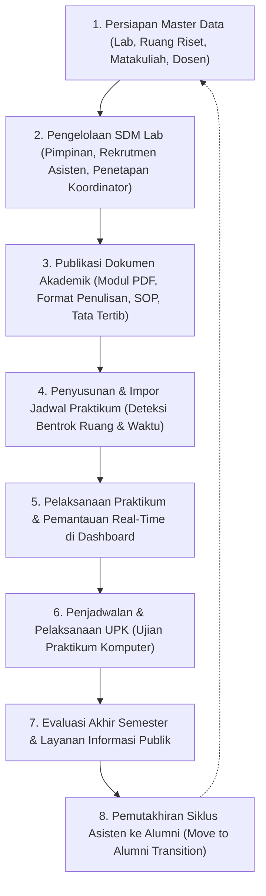
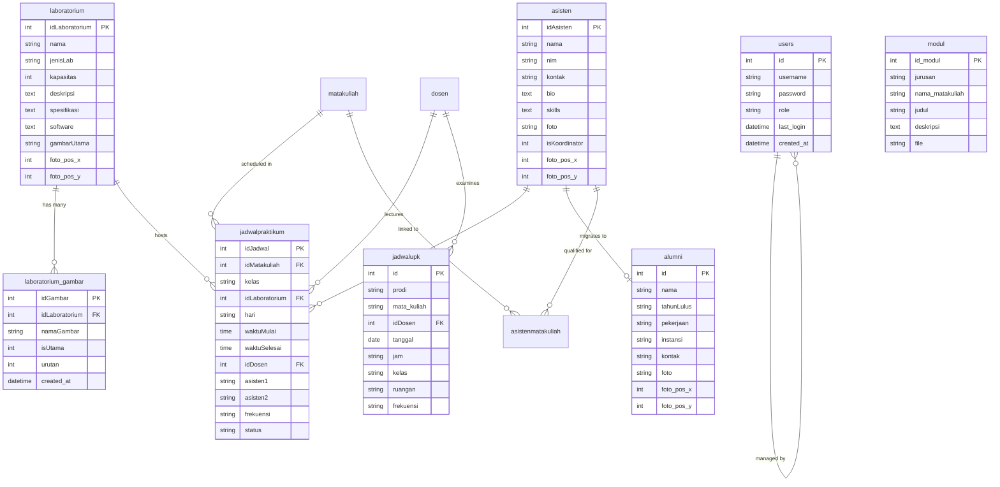
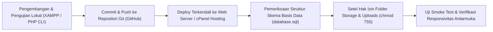

# BLUEPRINT APLIKASI
# SISTEM INFORMASI SUMBER DAYA LABORATORIUM (IC-LABS FIKOM UMI)

### Dokumen Pendukung Pengajuan Hak Kekayaan Intelektual
**Kategori Ciptaan: Program Komputer**

---

### Ruang Lingkup Dokumen
Blueprint ini mendeskripsikan rancangan, arsitektur, proses bisnis, struktur data, keamanan, integrasi, keluaran, dan karakteristik implementasi **Sistem Informasi Sumber Daya Laboratorium (IC-Labs FIKOM UMI)** berdasarkan *source code* pada snapshot yang disebutkan dalam dokumen.

**Versi 1.0**  
Makassar, 2026  
*Snapshot source: commit 8d3bb81 (2026-08-25 / Telaah Teknis Terkini 2026-09-07)*

---

## Lembar Identitas Ciptaan

| Elemen | Keterangan |
| :--- | :--- |
| **Nama Ciptaan** | Sistem Informasi Sumber Daya Laboratorium (IC-Labs FIKOM UMI) |
| **Jenis Ciptaan** | Program Komputer |
| **Bentuk Dokumentasi** | Blueprint Sistem dan Deskripsi Teknis-Fungsional |
| **Unit Pengelola** | Fakultas Ilmu Komputer, Universitas Muslim Indonesia |
| **Pencipta** | Kelompok 2 / Pengembang (Diisi sesuai formulir dan dokumen legal pengajuan HKI) |
| **Pemegang Hak Cipta** | Fakultas Ilmu Komputer, Universitas Muslim Indonesia (Diisi sesuai keputusan institusi) |
| **Alamat/Negara** | Jl. Urip Sumoharjo KM. 05, Kampus II UMI, Makassar, Sulawesi Selatan, Indonesia |
| **Domain Operasional** | https://iclabs.fikom.umi.ac.id *(atau repositori/server operasional institusi)* |
| **Versi Blueprint** | 1.0 / 2026 |
| **Basis Pemeriksaan** | Snapshot source commit `8d3bb81`, 2026-09-07 |

### Catatan Administratif
Nama pencipta, pemegang hak cipta, tanggal pertama kali diumumkan, tempat pertama kali diumumkan, dan nomor identitas pemohon wajib diselaraskan dengan surat pernyataan resmi, formulir permohonan pendaftaran ciptaan, serta surat keputusan pimpinan institusi. Dokumen blueprint teknis ini tidak menetapkan atau memindahtangankan kepemilikan hukum secara sepihak.

### Riwayat Dokumen
| Versi | Tanggal | Status | Keterangan |
| :--- | :--- | :--- | :--- |
| **1.0** | 7 September 2026 | Draf Siap Telaah | Blueprint awal disusun berdasarkan audit menyeluruh pada basis kode sumber (*source code*), struktur basis data, konfigurasi integrasi, dan pengujian fungsional aplikasi. |

### Pernyataan Penggunaan
Dokumen ini disusun khusus sebagai uraian teknis-fungsional resmi guna melengkapi berkas permohonan pendaftaran Hak Cipta atas Program Komputer pada Direktorat Jenderal Kekayaan Intelektual (DJKI) Kementerian Hukum dan HAM RI. Penjelasan difokuskan pada rancang bangun logika, relasi modul, arsitektur perangkat lunak, dan aturan bisnis. Seluruh kredensial rahasia, kata sandi, *environment keys*, data personal mahasiswa/dosen, serta data transaksi produksi tidak dimuat dalam dokumen ini.

---

## Daftar Isi

- [Lembar Identitas Ciptaan](#lembar-identitas-ciptaan)
- [Daftar Isi](#daftar-isi)
- [Ringkasan Eksekutif](#ringkasan-eksekutif)
- [1. Pendahuluan](#1-pendahuluan)
  - [1.1 Latar Belakang](#11-latar-belakang)
  - [1.2 Tujuan](#12-tujuan)
  - [1.3 Ruang Lingkup](#13-ruang-lingkup)
  - [1.4 Metode Penyusunan](#14-metode-penyusunan)
- [2. Identitas dan Batas Sistem](#2-identitas-dan-batas-sistem)
  - [2.1 Identitas Produk](#21-identitas-produk)
  - [2.2 Batas Sistem](#22-batas-sistem)
  - [2.3 Asumsi Operasional](#23-asumsi-operasional)
- [3. Arsitektur Aplikasi](#3-arsitektur-aplikasi)
  - [3.1 Lapisan Presentasi (Presentation Layer)](#31-lapisan-presentasi-presentation-layer)
  - [3.2 Lapisan Aplikasi (Application & Logic Layer)](#32-lapisan-aplikasi-application--logic-layer)
  - [3.3 Lapisan Domain dan Data (Domain & Data Layer)](#33-lapisan-domain-dan-data-domain--data-layer)
  - [3.4 Lapisan Integrasi (Integration Layer)](#34-lapisan-integrasi-integration-layer)
- [4. Peran dan Kendali Akses](#4-peran-dan-kendali-akses)
  - [4.1 Prinsip Otorisasi dan Keamanan Sesi](#41-prinsip-otorisasi-dan-keamanan-sesi)
- [5. Modul Fungsional](#5-modul-fungsional)
  - [5.1 Keterhubungan Antar-Modul](#51-keterhubungan-antar-modul)
- [6. Siklus Proses Bisnis Laboratorium](#6-siklus-proses-bisnis-laboratorium)
- [7. Arsitektur Data](#7-arsitektur-data)
  - [7.1 Kelompok Entitas](#71-kelompok-entitas)
  - [7.2 Prinsip Integritas Data](#72-prinsip-integritas-data)
- [8. Aturan Bisnis Utama](#8-aturan-bisnis-utama)
- [9. Dokumen, Berkas, dan Ekspor-Impor Data](#9-dokumen-berkas-dan-ekspor-impor-data)
  - [9.1 Standar Pengelolaan Berkas dan Media](#91-standar-pengelolaan-berkas-dan-media)
- [10. Keamanan dan Privasi](#10-keamanan-dan-privasi)
  - [10.1 Risiko dan Penguatan Lanjutan](#101-risiko-dan-penguatan-lanjutan)
- [11. Integrasi Sistem](#11-integrasi-sistem)
  - [11.1 Kontrak REST API Ringkas](#111-kontrak-rest-api-ringkas)
- [12. Deploy dan Operasional](#12-deploy-dan-operasional)
  - [12.1 Prosedur Rilis](#121-prosedur-rilis)
  - [12.2 Backup dan Pemulihan](#122-backup-dan-pemulihan)
- [13. Pengujian dan Jaminan Mutu](#13-pengujian-dan-jaminan-mutu)
  - [13.1 Kriteria Siap Rilis](#131-kriteria-siap-rilis)
- [14. Karakteristik dan Unsur Orisinal Karya](#14-karakteristik-dan-unsur-orisinal-karya)
  - [14.1 Batas Klaim terhadap Komponen Pihak Ketiga](#141-batas-klaim-terhadap-komponen-pihak-ketiga)
- [15. Spesifikasi Teknis](#15-spesifikasi-teknis)
  - [15.1 Inventaris Source pada Snapshot](#151-inventaris-source-pada-snapshot)
- [16. Batasan dan Peta Pengembangan](#16-batasan-dan-peta-pengembangan)
- [17. Kesimpulan](#17-kesimpulan)
- [Lampiran A. Matriks Modul dan Peran](#lampiran-a-matriks-modul-dan-peran)
- [Lampiran B. Kamus Istilah](#lampiran-b-kamus-istilah)
- [Lampiran C. Daftar Kelengkapan Pengajuan HKI](#lampiran-c-daftar-kelengkapan-pengajuan-hki)
- [Lampiran D. Jejak Teknis Blueprint](#lampiran-d-jejak-teknis-blueprint)

---

## Ringkasan Eksekutif

**Sistem Informasi Sumber Daya Laboratorium (IC-Labs FIKOM UMI)** adalah platform perangkat lunak web komprehensif yang dirancang dan dibangun untuk mengorkestrasi, mendokumentasikan, dan mengelola seluruh ekosistem sumber daya laboratorium terpadu di lingkungan Fakultas Ilmu Komputer Universitas Muslim Indonesia (FIKOM UMI). 

Aplikasi mengintegrasikan pengelolaan sarana fisik (ruang laboratorium komputer, laboratorium riset khusus, spesifikasi perangkat keras, software pendukung, galeri foto interaktif, dan denah spasial), sumber daya manusia (pimpinan/kepala laboratorium, staf dosen pembina, koordinator asisten, asisten laboratorium aktif, dan database alumni asisten), serta operasional akademik praktikum (jadwal praktikum mingguan, jadwal Ujian Praktikum Komputer/UPK, distribusi modul praktikum PDF, panduan format penulisan laporan, serta penegakan tata tertib dan sanksi laboratorium).

Sistem menerapkan arsitektur *Model-View-Controller* (MVC) berbasis PHP murni dengan *Custom Router* berkinerja tinggi, *Service Layer* yang memisahkan logika bisnis kompleks, *file-based caching* dengan TTL (*Time To Live*) dan mekanisme *rate limiting* mitigasi *brute-force*, serta sistem optimasi gambar terkompresi WebP berbasis PHP GD Library. Aplikasi membedakan dua ranah akses utama: ranah publik responsif berfitur tema ganda (*Day/Night Mode*) untuk mahasiswa dan masyarakat akademik, serta ranah administratif (*Back-Office*) yang aman dengan proteksi sesi ketat dan *Role-Based Access Control* (Super Admin & Admin Lab).

### Cakupan Klaim Karya
Klaim ciptaan program komputer diarahkan pada susunan arsitektur source code, perancangan modul, algoritma *smart matching & entity resolution* pada impor massal jadwal Excel, mekanisme mutasi riwayat hidup asisten ke alumni (*lifecycle transition*), sistem penyesuaian posisi titik fokus foto profil (*focal point offset coordinates*), generator dan router terpusat, struktur model data relasional, antarmuka grafis terpadu, serta tata kelola dokumen operasional laboratorium. Framework utilitas, pustaka sumber terbuka (*open-source libraries*), ikonografi, serta identitas logo resmi institusi tetap tunduk pada hak cipta dan lisensi masing-masing pemilik hak.

---

## 1. Pendahuluan

### 1.1 Latar Belakang
Laboratorium komputer pada perguruan tinggi memegang peranan krusial sebagai pusat praktikum, sertifikasi keahlian, dan penelitian mahasiswa maupun dosen. Di lingkungan Fakultas Ilmu Komputer Universitas Muslim Indonesia (FIKOM UMI), operasional laboratorium melibatkan multi-fasilitas (laboratorium jaringan, data science, IoT, kecerdasan buatan, microcontroller, multimedia, dan ruang riset), puluhan asisten praktikum aktif, ribuan mahasiswa peserta praktikum lintas program studi (Teknik Informatika dan Sistem Informasi), serta pelaksanaan ujian semester berupa Ujian Praktikum Komputer (UPK).

Pengelolaan konvensional yang mengandalkan dokumen terpisah (*spreadsheet*, berkas pengolah kata lokal, papan pengumuman fisik, atau grup pesan singkat) rentan menimbulkan berbagai permasalahan institusional:
1. **Risiko Bentrok Jadwal**: Penjadwalan praktikum dan penggunaan ruangan yang tumpang tindih antara kelas reguler dan ujian.
2. **Keterlambatan Distribusi Materi**: Hambatan mahasiswa dalam mengakses modul praktikum terbaru, pedoman penulisan, dan Standard Operating Procedure (SOP).
3. **Disorganisasi Data Asisten & Alumni**: Kehilangan jejak rekam jejak (*track record*) keahlian asisten dan alumni yang telah menyelesaikan masa baktinya.
4. **Beban Rekapitulasi Manual**: Proses input data jadwal praktikum dan UPK dari bagian akademik yang memakan waktu lama dan rawan kesalahan transkripsi.

Guna mengatasi tantangan tersebut, dibangunlah **IC-Labs FIKOM UMI** sebagai sistem sentral terintegrasi yang menyatukan seluruh tata kelola sumber daya laboratorium ke dalam satu basis data dan platform web modern yang dapat diakses secara transparan, cepat, dan aman.

### 1.2 Tujuan
1. **Pusat Informasi Sumber Daya Tunggal (*Single Source of Truth*)**: Menyediakan portal data terpadu untuk fasilitas laboratorium, asisten, dosen, jadwal praktikum, dan jadwal UPK.
2. **Automasi Pemrosesan Data Masal**: Mempercepat input jadwal praktikum dan UPK melalui fitur unggah dan parsing otomatis berkas Microsoft Excel (.xlsx/.xls) dengan integrasi pustaka *PhpSpreadsheet*.
3. **Penyelarasan Siklus Hidup Asisten Laboratorium**: Memfasilitasi pencatatan profil asisten, penetapan koordinator lab secara dinamis, hingga mekanisme migrasi satu klik menuju basis data alumni asisten (*move-to-alumni*).
4. **Peningkatan Kualitas Layanan Akademik**: Mempermudah mahasiswa dalam mengunduh modul praktikum PDF per jurusan (TI & SI), tata tertib, sanksi, dan format penulisan laporan secara real-time.
5. **Transparansi dan Aksesibilitas**: Menyediakan antarmuka modern yang responsif (desktop, tablet, mobile) yang dilengkapi fitur *Dark/Night Mode* untuk kenyamanan visual sivitas akademika.

### 1.3 Ruang Lingkup
Dokumen blueprint ini mencakup:
- Karakteristik arsitektur perangkat lunak MVC PHP Native, konfigurasi lingkungan, dan routing URL.
- Mekanisme autentikasi, otorisasi peran (*Super Admin* dan *Admin Lab*), proteksi rute, dan mitigasi keamanan (Rate Limiting, Prepared Statements, Sanitasi Input).
- Logika bisnis pengolahan jadwal, deteksi bentrok, *smart search foreign entity*, dan mutasi status.
- Desain antarmuka, tata kelola aset media (kompresi gambar WebP, koordinat posisi foto), serta penanganan berkas PDF (modul, format penulisan, SOP).
- Kontrak antarmuka pemrograman aplikasi (REST API internal JSON) yang digunakan untuk konsumsi AJAX.
- Prosedur rilis (*deployment*), pencadangan data (*backup*), penjaminan mutu (*testing*), dan inventaris artefak kode sumber.

### 1.4 Metode Penyusunan
Dokumen disusun melalui telaah audit komprehensif terhadap basis kode sumber (*source code review*) pada snapshot commit `8d3bb81`, penelusuran arsitektur basis data, analisis lalu lintas permintaan HTTP pada router dan controller, inspeksi pustaka dependensi Composer, serta eksekusi skrip pengujian fungsional otomatis dan verifikasi antarmuka visual.

---

## 2. Identitas dan Batas Sistem

### 2.1 Identitas Produk
| Aspek | Deskripsi |
| :--- | :--- |
| **Nama Aplikasi** | Sistem Informasi Sumber Daya Laboratorium (IC-Labs FIKOM UMI) |
| **Jenis Aplikasi** | Web Application (Sistem Informasi Manajemen Sumber Daya & Layanan Akademik Laboratorium) |
| **Pengguna Utama** | Mahasiswa, Asisten Lab, Dosen Pembina, Pimpinan/Kepala Lab, dan Administrator Lab |
| **Teknologi Inti** | PHP 7.4+ / 8.x Native (Custom MVC), MySQL/MariaDB, Tailwind CSS v4, Vanilla CSS3, JavaScript ES6+, AJAX |
| **Pustaka Utama** | `phpoffice/phpspreadsheet` (Pengolah Excel), `phpmailer/phpmailer` (Notifikasi SMTP), `vlucas/phpdotenv` (Manajemen .env) |
| **Output Utama** | Portal publik terpadu, Dashboard analitik, Jadwal interaktif, Modul PDF, Template Excel, Galeri Lab WebP, REST API JSON |
| **Lingkungan Kerja** | Server Lokal XAMPP / Apache, Repositori Git (GitHub), Server Produksi Hosting Berbasis Linux / cPanel |

### 2.2 Batas Sistem
- **Di Dalam Batas Sistem (*Internal Scope*)**:
  - Subsistem Autentikasi: Login, logout, proteksi brute-force berbasis IP/Email, update *last login*, manajemen akun admin.
  - Subsistem Master Data: Manajemen data Dosen, Mata Kuliah, Laboratorium, Ruang Riset, Gambar Galeri, dan Pimpinan.
  - Subsistem SDM: Manajemen Asisten (keahlian, kontak, foto, status koordinator), migrasi alumni, dan direktori alumni.
  - Subsistem Akademik: Jadwal Praktikum (CRUD, deteksi duplikasi, import Excel), Jadwal UPK (CRUD, import Excel, filter prodi), Modul PDF per jurusan (TI/SI), Format Penulisan, Peraturan Lab, Sanksi Lab, dan SOP.
  - Subsistem Konten & Media: Slider Showcase beranda, Denah interaktif lantai lab, kompresi otomatis gambar ke WebP via GD.
  - Subsistem Integrasi: Handler kontak publik dengan dispatching email otomatis melalui protokol SMTP.
- **Di Luar Batas Sistem (*External Boundary*)**:
  - Layanan Mail Server Eksternal (Google SMTP / Domain SMTP Institusi).
  - Peta Spasial Eksternal (Google Maps Embed API).
  - Browser Pengguna (Google Chrome, Mozilla Firefox, Safari, Microsoft Edge).
  - Infrastruktur Server Web Hosting & Database Engine MySQL/MariaDB.

### 2.3 Asumsi Operasional
1. Web server menjalankan PHP versi minimal 7.4 dengan ekstensi wajib aktif: `pdo_mysql`, `mysqli`, `gd` (dengan dukungan WebP & JPEG/PNG), `mbstring`, `fileinfo`, `zip`, dan `openssl`.
2. Akun administrator dibuat dan dikendalikan oleh Super Admin; pendaftaran publik ditiadakan untuk menjaga integritas data sistem.
3. Hak tulis (*write permission*) tersedia penuh pada direktori penyimpanan `public/assets/uploads/` (subfolder `asisten`, `laboratorium`, `modul`, `pdf`, `format_penulisan`, `manajemen`) dan direktori `app/cache/` serta `storage/logs/`.
4. Berkas Excel jadwal praktikum dan UPK yang diunggah mengikuti struktur kolom sesuai dokumen template yang disediakan sistem.

---

## 3. Arsitektur Aplikasi

Aplikasi dibangun menggunakan pola arsitektur **Model-View-Controller (MVC)** kustom yang dirancang efisien, modular, dan terstruktur tanpa membebani performa server.

```mermaid
flowchart TD
    subgraph PENGGUNA["PENGGUNA & KANAL AKSES"]
        U1["Mahasiswa & Dosen (Publik)"]
        U2["Admin Laboratorium"]
        U3["Super Administrator"]
    end

    subgraph PRESENTASI["LAPISAN PRESENTASI (PRESENTATION LAYER)"]
        V1["Blade/PHP Views (Tailwind CSS v4 + Vanilla CSS)"]
        V2["Komponen Tema (Day Mode / Night Mode Engine)"]
        V3["Dynamic DOM & AJAX Controllers (public/js/*)"]
        V4["Modal Dialogs, Image Cropper & Media Previews"]
    end

    subgraph APLIKASI["LAPISAN APLIKASI & KONTROL (APPLICATION LAYER)"]
        R1["Router Regex Dynamic Matcher (app/config/Router.php)"]
        M1["AuthMiddleware (Session & Role Verification)"]
        C1["Base Controller (View Rendering, Flash Messages, JSON Responses)"]
        C2["22 Domain Controllers (Asisten, Jadwal, Fasilitas, User, dll.)"]
        S1["Service Layer (JadwalPraktikumService, JadwalUpkService, DashboardService, dll.)"]
    end

    subgraph DOMAIN_DATA["LAPISAN DOMAIN & DATA (DATA LAYER)"]
        MD1["Base Model (CRUD Operations via MySQLi Prepared Statements)"]
        MD2["17 Domain Entity Models (Jadwal, Asisten, Modul, User, Lab, dll.)"]
        H1["File-Based Cache Engine (app/helpers/Cache.php)"]
        H2["GD Image Optimizer Engine (app/helpers/ImageOptimizer.php)"]
    end

    subgraph INFRA_INTEGRASI["LAPISAN INTEGRASI & INFRASTRUKTUR"]
        DB[(Basis Data MySQL / MariaDB)]
        FS[("Penyimpanan Berkas Fisik (public/assets/uploads/)")]
        SMTP["Google SMTP Server (PHPMailer Integration)"]
        XLS["PhpSpreadsheet IO Engine (.xlsx/.xls Parser)"]
    end

    PENGGUNA --> PRESENTASI
    PRESENTASI --> APLIKASI
    APLIKASI --> DOMAIN_DATA
    DOMAIN_DATA --> INFRA_INTEGRASI
```

### 3.1 Lapisan Presentasi (Presentation Layer)
Antarmuka pengguna disusun menggunakan komponen PHP View responsif berpadu dengan framework utilitas **Tailwind CSS v4** dan kustomisasi gaya CSS3 modular. Fitur utama lapisan presentasi meliputi:
- **Dual Mode Visual (*Day/Night Mode*)**: Deteksi tema berbasis *client-side* (*LocalStorage*) yang disinkronkan dengan *HTTP Cookies* untuk mencegah *screen flickering* saat pemuatan halaman pertama (*Anti-Flicker Script*).
- **Komponen Dinamis & Asinkron**: Seluruh tabel admin, modal konfirmasi, filter pencarian instan (*instant search/filter*), dan pemutakhiran data dijalankan via antarmuka JavaScript berbasis *Fetch API/AJAX* tanpa perlu memuat ulang (*full reload*) halaman.
- **UI Fallback Cerdas**: Integrasi dinamis dengan layanan *UI-Avatars API* untuk merender avatar visual secara otomatis jika foto pengguna/asisten tidak diunggah.

### 3.2 Lapisan Aplikasi (Application & Logic Layer)
- **Router Terpusat**: Kelas `Router` menangani pendaftaran rute HTTP (GET, POST, PUT, DELETE) dengan parser ekspresi reguler dinamis untuk menangkap parameter URL numerik maupun *slug string* (seperti `/laboratorium/{id}`, `/asisten/{id}/move-to-alumni`). Mendukung *HTTP Method Spoofing* melalui input `_method`.
- **Middleware Keamanan**: `AuthMiddleware` memeriksa keabsahan sesi login aktif, mengamankan rute panel admin (`/admin/*`), serta mencegat mutasi data ilegal pada endpoint API (`POST`, `PUT`, `DELETE`).
- **Pemisahan Logika Bisnis (*Service Layer*)**: Memisahkan kalkulasi berat dari controller. Contoh: `JadwalPraktikumService` menangani iterasi baris *spreadsheet*, resolusi relasi foreign key entitas dosen/matakuliah/lab, serta validasi bentrok jadwal; `DashboardService` mengkalkulasi jadwal praktikum yang sedang aktif secara *real-time* berdasarkan zona waktu WITA (Asia/Makassar).

### 3.3 Lapisan Domain dan Data (Domain & Data Layer)
- **Koneksi Ganda Terpadu**: Mengombinasikan koneksi *PDO* (untuk penanganan transaksi data terstruktur pada model seperti `JadwalUpkModel`, `ModulModel`, dan `SopModel`) serta *MySQLi* dengan *Prepared Statements* (pada kelas `Model` dasar untuk operasi CRUD umum).
- **Cache Berbasis Berkas (*File-Based JSON Cache*)**: Menyimpan data berulang dengan mekanisme *TTL (Time To Live)* untuk mempercepat waktu respon dan mencatat batas percobaan autentikasi pengguna.
- **Image Optimizer**: Memeriksa dimensi, orientasi EXIF kamera, mengompresi gambar, dan mengonversinya ke format generasi modern (WebP) guna menghemat kapasitas penyimpanan server hingga 70%.

### 3.4 Lapisan Integrasi (Integration Layer)
Menghubungkan aplikasi secara aman dengan layanan pihak ketiga melalui:
- **PHPMailer (SMTP)**: Menyalurkan pesan dari formulir kontak publik langsung ke kotak masuk surel administrator melalui saluran terenkripsi TLS.
- **PhpSpreadsheet IO Engine**: Melakukan ekstraksi baris data dari file biner Microsoft Excel.
- **REST API Internal**: Menyediakan antarmuka data format JSON bagi kebutuhan interaksi komponen antar muka dan integrasi masa depan.

---

## 4. Peran dan Kendali Akses

Sistem menerapkan kendali akses berbasis peran (*Role-Based Access Control*) yang memisahkan hak istimewa pengguna ke dalam 3 tingkatan utama:

| Level | Peran (*Role*) | Ruang Kewenangan Utama |
| :---: | :--- | :--- |
| **1** | **Super Admin** | Akses penuh atas seluruh fitur sistem, konfigurasi global, manajemen pengguna admin (buat akun admin baru, ubah peran, hapus akun, dan reset kata sandi), serta kontrol database dan operasional laboratorium. |
| **2** | **Admin Lab** | Akses ke seluruh modul operasional laboratorium: manajemen master data fasilitas, galeri lab, pimpinan, data dosen, mata kuliah, pengelolaan asisten & alumni, pengunggahan jadwal praktikum/UPK (manual maupun import Excel), unggah modul praktikum, format penulisan, peraturan & sanksi, SOP, dan slider showcase. Tidak berwenang menambah/menghapus akun administrator lain. |
| **3** | **Publik / Mahasiswa / Dosen** | Akses baca (*read-only*) ke portal publik: melihat profil fasilitas & ruang riset, denah laboratorium, direktori asisten & alumni, jadwal praktikum aktif, jadwal ujian UPK, mengunduh modul praktikum PDF & berkas format penulisan, melihat tata tertib/sanksi/SOP lab, serta mengirim pesan melalui formulir kontak. |

### 4.1 Prinsip Otorisasi dan Keamanan Sesi
1. **Pemeriksaan Sesi Ketat (*Session Enforcement*)**: Setiap akses ke jalur `/admin/*` diverifikasi oleh `index.php` dan `Router.php`. Pengguna tanpa sesi `status == 'login'` dan `user_id` otomatis dialihkan ke halaman login `/iclabs-login`.
2. **Proteksi Mutasi Rute**: Semua permintaan mutasi data (`POST`, `PUT`, `DELETE`) pada seluruh endpoint wajib melewati verifikasi otentikasi, kecuali rute publik terbuka yang ditentukan secara eksplisit (seperti `/login` dan `/kontak/send`).
3. **Penyekatan Menu Berdasarkan Peran**: Menu **"Manajemen User"** (`/admin/user`) pada bilah navigasi sisi (*sidebar*) hanya ditampilkan dan diizinkan dieksekusi jika `$_SESSION['role'] === 'super_admin'`. Permintaan tidak sah akan ditolak pada level controller dengan kode respon 403 (*Forbidden*).
4. **Perlindungan Brute-Force Login**: Penerapan algoritma *Rate Limiting* berbasis kombinasi alamat IP dan identitas email pengguna (maksimal 5 kali percobaan gagal; penguncian akun selama 15 menit secara otomatis).

---

## 5. Modul Fungsional

Berikut adalah matriks modul-modul fungsional yang dibangun dalam sistem:

| Modul | Fungsi Utama |
| :--- | :--- |
| **Autentikasi & Akun** | Login administrator, logout dengan pembersihan sesi total (*session destroy*), pelacakan waktu login terakhir (*last login tracking*), dan enkripsi sandi menggunakan algoritma *Bcrypt*. |
| **Manajemen Pengguna** | Manajemen akun admin oleh Super Admin: penambahan akun, peremajaan data, penggantian kata sandi, dan eliminasi akun dengan proteksi anti-hapus akun sendiri (*self-deletion prevention*). |
| **Fasilitas & Lab** | Katalog profil laboratorium komputer dan ruang riset: nama, kode, lokasi, kapasitas mahasiswa, spesifikasi hardware, software terpasang, denah interaktif, dan status ketersediaan. |
| **Galeri Laboratorium** | Pengelolaan multi-foto per laboratorium (`laboratorium_gambar`), penetapan foto utama (*cover*), pengaturan urutan gambar, dan optimasi kompresi WebP otomatis. |
| **Asisten Laboratorium** | Direktori asisten aktif: nama, stambuk/NIM, kontak, bio, keahlian (*skills*), foto profil dengan kustomisasi titik fokus (*foto_pos_x* dan *foto_pos_y*), serta penetapan satu koordinator lab. |
| **Mutasi Alumni** | Fitur transisi siklus hidup asisten ke alumni (*move-to-alumni*), pemindahan data otomatis ke tabel `alumni`, direktori alumni dengan filter tahun kelulusan/angkatan. |
| **Manajemen Pimpinan** | Profil pimpinan laboratorium (Kepala Laboratorium, Atasan Langsung, Koordinator Divisi), jabatan, NIDN/NIP, periode jabatan, dan foto profil. |
| **Dosen & Mata Kuliah** | Master data Dosen pengampu praktikum (nama, NIP) dan Master Mata Kuliah (kode matakuliah, nama, SKS, semester, kurikulum) serta relasi asisten pendamping. |
| **Jadwal Praktikum** | Pengelolaan jadwal praktikum mingguan: hari, jam mulai, jam selesai, kelas, ruang lab, dosen pengampu, asisten 1, dan asisten 2. Mendukung deteksi bentrok jadwal, filter instan, dan bulk delete. |
| **Impor Jadwal Praktikum** | Fasilitas unggah berkas Excel (.xlsx/.xls) massal via `PhpSpreadsheet`, *smart search* pencocokan nama asisten/dosen/lab, pembuatan master data otomatis jika belum ada, dan laporan statistik impor. |
| **Jadwal UPK** | Jadwal Ujian Praktikum Komputer: prodi (TI/SI), tanggal ujian, sesi jam, mata kuliah, dosen penguji, kelas, ruangan, dan frekuensi. Mendukung entri manual dan unggah massal Excel/CSV. |
| **Modul Praktikum** | Pengelolaan berkas modul praktikum digital (PDF), klasifikasi per program studi (Teknik Informatika / Sistem Informasi), deskripsi modul, dan pengunduhan langsung oleh mahasiswa. |
| **SOP Laboratorium** | Pengelolaan dokumen Standard Operating Procedure (SOP) laboratorium: pemeliharaan perangkat, penanganan barang rusak, aset, dan tata kelola dalam format PDF. |
| **Format Penulisan** | Penyediaan pedoman dan template dokumen format penulisan laporan praktikum dan tugas akhir mahasiswa dalam format DOCX/PDF. |
| **Peraturan & Sanksi** | Publikasi tata tertib umum dan khusus laboratorium, serta klasifikasi sanksi pelanggaran (kategori Ringan, Sedang, dan Berat) guna menjaga ketertiban praktikum. |
| **Showcase Slider** | Pengelolaan slider promosi dan pengumuman visual di beranda (*home*): teks lencana (*badge*), judul, deskripsi, tautan rujukan (*call to action*), urutan, dan galeri foto showcase. |
| **Kontak & Komunikasi** | Formulir kontak pengunjung yang terhubung langsung ke layanan Google Mail via protokol SMTP PHPMailer untuk penyampaian kritik, saran, maupun pertanyaan resmi. |
| **Dashboard & Statistik** | Panel ringkasan eksekutif admin yang memuat metrik akumulasi: total asisten, total lab, total alumni, dan pemantauan jadwal praktikum yang sedang aktif berjalan di hari tersebut. |

### 5.1 Keterhubungan Antar-Modul
Modul-modul di dalam sistem saling terkait dalam satu ekosistem data yang padu:
1. **Jadwal Praktikum** mengikat data dari entitas **Mata Kuliah**, **Laboratorium**, **Dosen**, dan dua orang **Asisten Laboratorium**.
2. **Impor Excel Jadwal** secara cerdas melakukan kueri referensi silang: jika nama mata kuliah atau dosen dalam lembar kerja belum terdaftar, sistem secara otomatis menginisiasi entitas master baru (*auto-resolve and create*).
3. **Modul Asisten** terhubung secara siklikal dengan **Modul Alumni**; eksekusi *Move to Alumni* mentransfer profil asisten secara mulus tanpa merusak relasi historis pada jadwal praktikum sebelumnya.
4. **Modul Fasilitas** menjadi induk dari tabel relasional **Galeri Gambar Laboratorium** (`laboratorium_gambar`), yang menyajikan galeri foto responsif dan denah interaktif.

---

## 6. Siklus Proses Bisnis Laboratorium

Berikut adalah siklus tata kelola operasional laboratorium terpadu yang diakomodasi oleh sistem:

| Tahap | Proses Bisnis | Kendali Utama Sistem |
| :---: | :--- | :--- |
| **1** | **Persiapan Fasilitas & Master Data** | Perekaman spesifikasi komputer, software, kapasitas ruangan, pemetaan denah, serta master kurikulum mata kuliah dan dosen. |
| **2** | **Konfigurasi SDM Laboratorium** | Registrasi profil asisten, kustomisasi fokus foto (*focal offset*), dan penentuan tepat 1 koordinator lab (reset otomatis koordinator sebelumnya). |
| **3** | **Publikasi Dokumen Penunjang** | Validasi jenis file PDF dan ukuran berkas pada pengunggahan modul praktikum, format laporan, dan SOP lab. |
| **4** | **Penyusunan Jadwal Praktikum** | Pengecekan integritas jadwal: validasi duplikasi kombinasi Ruang Lab + Hari + Jam Mulai/Selesai + Mata Kuliah + Kelas. |
| **5** | **Monitoring Operasional Harian** | Agregasi dashboard menampilkan jadwal yang sedang berjalan pada jam server lokal terkini (WITA). |
| **6** | **Pelaksanaan Ujian UPK** | Penjadwalan sesi UPK lintas prodi (Teknik Informatika & Sistem Informasi), pembagian ruangan, dan dosen penguji. |
| **7** | **Penyampaian Masukan Sivitas** | Formulir kontak memvalidasi data pengunjung dan menyalurkan pesan via SMTP secara terenkripsi ke email administrator. |
| **8** | **Purna Tugas & Regenerasi SDM** | Aksi migrasi satu klik memindahkan asisten demisioner ke database alumni untuk pembinaan jejaring lulusan. |

---

## 7. Arsitektur Data

### 7.1 Kelompok Entitas
Basis data aplikasi mengorganisasikan informasi ke dalam beberapa klaster entitas utama:

| Kelompok | Contoh Entitas Tabel | Informasi yang Dikelola |
| :--- | :--- | :--- |
| **Identitas & Akun** | `users` | Akun administrator, hash password (*Bcrypt*), tingkatan peran (*super_admin*/*admin*), rekam jejak waktu login. |
| **Fasilitas & Sarana** | `laboratorium`, `laboratorium_gambar` | Identitas laboratorium/ruang riset, kapasitas, rincian hardware & software, galeri foto, denah visual. |
| **Sumber Daya Manusia** | `asisten`, `alumni`, `manajemen`, `dosen` | Biodata asisten, status koordinator, rekam jejak alumni, profil kepala lab/pimpinan, database dosen pengampu. |
| **Akademik & Jadwal** | `jadwalpraktikum`, `jadwalupk`, `matakuliah`, `asistenmatakuliah` | Jadwal mingguan lab, jadwal ujian UPK, kurikulum mata kuliah, pemetaan asisten pada mata kuliah praktikum. |
| **Dokumen & Regulasi** | `modul`, `sop`, `format_penulisan`, `peraturan_lab`, `sanksi_lab` | Berkas PDF modul praktikum per prodi, pedoman format dokumen akademik, tata tertib, dan sanksi pelanggaran. |
| **Presentasi Beranda** | `home_showcase` | Slider interaktif beranda, teks lencana (*badge*), konten promosi, galeri gambar showcase, status aktifasi. |

### 7.2 Prinsip Integritas Data
1. **Proteksi Integritas Relasi Kustom (*Manual Foreign Key Guard*)**: Sebelum record laboratorium dihapus, `FasilitasModel::hasJadwal()` secara wajib mengecek apakah laboratorium tersebut masih terikat dalam jadwal praktikum aktif guna mencegah terjadinya *orphaned records*.
2. **Pencegahan Redundansi Koordinator**: Sebelum menandai asisten tertentu sebagai koordinator (`isKoordinator = 1`), sistem mengeksekusi metode `AsistenModel::resetAllKoordinator()` untuk menolkan status asisten lain, menjamin azas kepemimpinan tunggal.
3. **Sanitasi Kueri Berbasis Parameterized Statements**: Seluruh kueri pembacaan, penyisipan, dan pembaruan data menggunakan mekanisme *prepared statements* (baik melalui MySQLi `bind_param` maupun PDO `prepare/execute`) sehingga 100% terlindung dari ancaman *SQL Injection*.
4. **Sanitasi Nilai Koordinat**: Fungsi utilitas `Helper::clampPercent()` memastikan nilai offset posisi foto selalu berada dalam rentang valid 0% hingga 100%.

---

## 8. Aturan Bisnis Utama

| Area Bisnis | Aturan Implementasi pada Source Code |
| :--- | :--- |
| **Klasifikasi Program Studi** | Pengelompokan data modul praktikum dan jadwal UPK secara ketat membedakan antara program studi **Teknik Informatika (TI)** dan **Sistem Informasi (SI)**. |
| **Pencegahan Bentrok Jadwal** | Sistem menolak penambahan atau impor jadwal baru jika ditemukan jadwal lain pada hari yang sama, ruangan lab yang sama, dan rentang waktu yang beririsan (*time collision detection*). |
| **Smart Entity Resolution pada Impor** | Pada saat membaca baris Excel jadwal: nama dosen dicari ke tabel `dosen`; jika belum ada, sistem secara otomatis menyisipkan data dosen baru dan mengambil ID yang dihasilkan. Hal serupa berlaku untuk entitas mata kuliah. |
| **Smart Name Matching Asisten** | Sistem menggunakan 3 level pencarian ID asisten dari file Excel: *Exact Match* (pencocokan nama persis), *Partial Match* (pencarian LIKE), dan *Fallback* (menyimpan nama sebagai string jika ID numerik tidak ditemukan). |
| **Siklus Hidup Asisten ke Alumni** | Fungsi `moveToAlumni` menyalin data asisten ke tabel alumni, menambahkan tahun kelulusan, dan menghapus record dari tabel asisten aktif dalam satu alur teratur. |
| **Kompensasi Titik Fokus Foto** | Foto profil asisten, pimpinan, dan fasilitas dilengkapi parameter koordinat `foto_pos_x` dan `foto_pos_y` untuk menjamin wajah atau objek utama tetap berada tepat di tengah saat dirender pada bingkai melingkar (*avatar circle*). |
| **Pembatasan Rate Limit Login** | Percobaan login dibatasi maksimal 5 kali kegagalan per 15 menit. Percobaan ke-6 akan memicu respons pemblokiran dengan pesan sisa durasi penguncian (*lockout cooldown*). |
| **Pembersihan Logika Sesi Logout** | Prosedur logout mengeksekusi `session_unset()` dan `session_destroy()` sebelum memulai sesi bersih baru untuk menyalurkan *flash message* sukses ke pengguna. |

---

## 9. Dokumen, Berkas, dan Ekspor-Impor Data

| Jenis Keluaran / Berkas | Format | Karakteristik / Kontrol Implementasi |
| :--- | :---: | :--- |
| **Template Impor Jadwal Praktikum** | Excel (.xlsx) | Lembar kerja berisi tajuk baku (No, Kode MK, Dosen, Mata Kuliah, SKS, Kelas, Frekuensi, Lab, Hari, Jam, Ruangan, Asisten 1, Asisten 2). Dibuat via `PhpSpreadsheet`. |
| **Template Impor Jadwal UPK** | Excel (.xlsx) | Lembar kerja standar berisikan kolom Prodi, Tanggal, Jam, Mata Kuliah, Dosen, Frekuensi, Kelas, dan Ruangan ujian UPK. |
| **Modul Praktikum Digital** | PDF | Berkas materi ajar praktikum terunggah per semester, terklasifikasi berdasarkan jurusan (TI/SI), diunduh langsung melalui streaming file browser. |
| **Dokumen SOP Laboratorium** | PDF | Berkas Standard Operating Procedure resmi untuk operasional dan tata tertib penggunaan laboratorium. |
| **Template Format Penulisan** | DOCX / PDF | Berkas acuan tata tulis laporan praktikum mahasiswa, dilengkapi kategori dokumen dan tanggal pemutakhiran. |
| **Foto Fasilitas & Galeri Lab** | WebP | Seluruh berkas grafis hasil unggahan diproses otomatis oleh `ImageOptimizer` menjadi format WebP terkompresi berkualitas tinggi. |
| **Notifikasi Surel Kontak** | Email HTML | Template email responsif yang dikirim melalui SMTP server ke administrator, memuat nama pengirim, subjek, email balasan (*Reply-To*), dan isi pesan. |

### 9.1 Standar Pengelolaan Berkas dan Media
1. **Penamaan Berkas Unik (*Unique Filename Sanitization*)**: Setiap berkas yang diunggah diproses menggunakan fungsi `Helper::generateFilename()`, menghasilkan pola terstandarisasi: `{kategori}_{slug_nama}_{timestamp}_{random}.{ekstensi}` guna mencegah penimpaan berkas (*file overwrite*).
2. **Validasi Tipe Konten (*MIME Type Verification*)**: Berkas modul, SOP, dan format penulisan wajib bertipe dokumen resmi (`application/pdf`, `application/vnd.openxmlformats-officedocument.wordprocessingml.document`).
3. **Pembersihan File Fisik Saat Hapus Data**: Saat data modul, SOP, atau gambar galeri laboratorium dihapus dari basis data, sistem secara otomatis mengeksekusi fungsi `unlink()` untuk menghapus berkas fisik terkait di server, menghindari penumpukan berkas sampah (*orphaned storage bloat*).

---

## 10. Keamanan dan Privasi

Aplikasi menerapkan pertahanan keamanan berlapis (*Defense in Depth*) yang mencakup level transportasi, aplikasi, dan penyimpanan data:

| Area Kontrol | Mekanisme Implementasi |
| :--- | :--- |
| **Autentikasi Web** | Sesi berbasis *HttpOnly cookies*; pembersihan variabel sesi secara total saat logout; penolakan sesi parsial/korup. |
| **Otorisasi Rute** | `AuthMiddleware` memblokir akses ke rute administratif dan rute mutasi data (`POST`, `PUT`, `DELETE`) tanpa hak sesi. |
| **Enkripsi Kata Sandi** | Sandi pengguna disimpan menggunakan algoritma hashing satu arah standar industri `PASSWORD_DEFAULT` (*Bcrypt*) dengan garam acak (*salt*). |
| **Mitigasi Brute Force** | Pembatasan frekuensi percobaan (*Rate Limiting*) berbasis IP dan akun email menggunakan engine file cache JSON dengan penalti durasi blokir 900 detik (15 menit). |
| **Pencegahan SQL Injection** | 100% kueri database yang melibatkan input pengguna diproses melalui *Prepared Statements* dan *parameter binding* native (PDO & MySQLi). |
| **Pencegahan Cross-Site Scripting (XSS)** | Seluruh data dinamis yang ditampilkan ke antarmuka pengguna disaring menggunakan fungsi `htmlspecialchars()` atau `strip_tags()`. |
| **Isolasi Variabel Rahasia** | Kredensial basis data dan kredensial SMTP Gmail diisolasi dalam file `.env` di luar direktori web publik, dimuat via `vlucas/phpdotenv`. |
| **Logging Error Terkontrol** | Mode `DEBUG_MODE` dimatikan pada lingkungan produksi; pesan galat sensitif disembunyikan dari layar pengguna dan dialihkan ke berkas log `storage/logs/error.log`. |

### 10.1 Risiko dan Penguatan Lanjutan
| Area Risiko | Dampak Potensial | Rekomendasi Mitigasi Jangka Panjang |
| :--- | :--- | :--- |
| **Eksploitasi Token CSRF** | Serangan pemalsuan permintaan antar situs (*Cross-Site Request Forgery*) pada form POST | Menerapkan modul generator dan verifikator CSRF Token sinkron pada seluruh formulir mutasi admin. |
| **Penyalahgunaan Akun Admin** | Akses administratif tidak sah jika kata sandi bocor | Menambahkan verifikasi dua langkah (*Two-Factor Authentication / 2FA*) berbasis aplikasi OTP (Google Authenticator). |
| **Kapasitas Penyimpanan Penuh** | Unggahan dokumen PDF berukuran besar dapat menghabiskan kuota disk hosting | Penerapan kuota batas maksimal unggahan berkas (misal max 10MB) dan pemindahan berkas statis ke *Cloud Object Storage* (S3). |

---

## 11. Integrasi Sistem

| Layanan Terintegrasi | Pola Integrasi | Fungsi dan Pengendalian |
| :--- | :---: | :--- |
| **Google Mail SMTP Server** | Server-to-Server (TLS Port 587) | Pengiriman notifikasi formulir kontak dari publik ke administrator secara real-time via `PHPMailer`. |
| **PhpSpreadsheet Engine** | Pustaka Backend Lokal | Pembacaan dan pembuatan berkas *spreadsheet* (.xlsx) untuk proses impor dan ekspor jadwal praktikum/UPK. |
| **Google Maps Embed API** | Tautan Aman (Iframe Embed) | Penayangan lokasi presisi gedung Fakultas Ilmu Komputer UMI pada footer portal publik. |
| **UI-Avatars API** | RESTful HTTP Get | Penyedia gambar inisial nama secara otomatis sebagai fallback saat profil asisten/dosen belum memiliki foto unggahan. |
| **Internal REST API** | JSON Endpoints | Saluran transfer data terstruktur untuk komunikasi asinkron antarmuka pengguna (AJAX). |

### 11.1 Kontrak REST API Ringkas
Aplikasi menyediakan antarmuka API internal berformat JSON:

| Metode | Endpoint Rute | Fungsi dan Ruang Lingkup | Hak Akses |
| :---: | :--- | :--- | :---: |
| **GET** | `/api/jadwal` | Mengambil seluruh data jadwal praktikum beserta relasi dosen, lab, dan asisten | Publik |
| **POST** | `/api/jadwal` | Menambahkan baris jadwal praktikum baru | Admin (Auth) |
| **POST** | `/api/jadwal-praktikum/upload` | Mengunggah dan memproses berkas Excel jadwal praktikum | Admin (Auth) |
| **GET** | `/api/jadwal-praktikum/template` | Mengunduh berkas template Excel jadwal praktikum | Publik / Admin |
| **GET** | `/api/asisten` | Mengambil daftar lengkap asisten laboratorium | Publik |
| **POST** | `/api/asisten/{id}/move-to-alumni` | Memindahkan data asisten aktif ke basis data alumni | Admin (Auth) |
| **POST** | `/api/asisten/coordinator/set` | Menetapkan asisten terpilih sebagai Koordinator Laboratorium | Admin (Auth) |
| **GET** | `/api/fasilitas` | Mengambil seluruh data laboratorium dan fasilitas | Publik |
| **DELETE**| `/api/fasilitas/image/{id}` | Menghapus foto spesifik dari galeri laboratorium | Admin (Auth) |
| **GET** | `/api/jadwal-upk` | Mengambil daftar jadwal Ujian Praktikum Komputer | Publik |
| **POST** | `/api/jadwal-upk/upload` | Mengimpor berkas Excel jadwal ujian UPK | Admin (Auth) |
| **GET** | `/api/modul` | Mengambil katalog berkas modul praktikum PDF | Publik |
| **GET** | `/admin/dashboard/stats` | Mengambil data statistik dashboard (total asisten, alumni, lab, jadwal hari ini) | Admin (Auth) |
| **POST** | `/kontak/send` | Mengirimkan pesan formulir kontak publik via SMTP | Publik |

---

## 12. Deploy dan Operasional

### 12.1 Prosedur Rilis
1. **Pengembangan Lokal**: Penambahan modul atau perbaikan bug dikerjakan pada lingkungan lokal dengan pengujian sintaksis dan pengujian unit fungsional.
2. **Commit Terstruktur**: Perubahan dicatat ke repositori Git dengan pesan commit yang jelas dan deskriptif.
3. **Penyebaran (*Deployment*)**: Penarikan (*pull*) kode sumber ke server hosting produksi berbasis Linux / cPanel tanpa menimpa berkas `.env` produksi dan folder `public/assets/uploads/`.
4. **Instalasi Dependensi**: Menjalankan perintah `composer install --no-dev --optimize-autoloader` jika terjadi pemutakhiran pada berkas `composer.json`.
5. **Konfigurasi Izin Berkas**: Memastikan folder `public/assets/uploads/` dan `app/cache/` memiliki izin tulis (*write permission*) yang cukup (CHMOD 755 / 775).
6. **Verifikasi Pasca Rilis (*Smoke Test*)**: Memeriksa kelancaran pemuatan halaman utama, fungsi login admin, unduhan modul PDF, dan pengujian API JSON.

### 12.2 Backup dan Pemulihan
- **Basis Data**: Pencadangan berkala dilakukan menggunakan utilitas `mysqldump` terjadwal (cron job) yang diarsipkan ke penyimpanan sekunder aman.
- **Berkas Unggahan**: Direktori `public/assets/uploads/` disinkronkan secara periodik untuk memastikan seluruh dokumen PDF modul dan foto fasilitas terlindungi dari risiko kehilangan data.
- **Prosedur Pemulihan (*Disaster Recovery*)**: Pemulihan skema dan data dilakukan melalui mekanisme impor file cadangan SQL serta pemulihan folder aset media dalam hitungan menit jika terjadi insiden server.

---

## 13. Pengujian dan Jaminan Mutu

Penjaminan mutu perangkat lunak dilakukan secara komprehensif pada berbagai tingkatan:

| Jenis Pemeriksaan | Cakupan dan Metode Pengujian | Status Hasil |
| :--- | :--- | :---: |
| **Unit & Service Test** | Pengujian logika bisnis `JadwalPraktikumService`, `JadwalUpkService`, dan `DashboardService` via CLI. | **LULUS** |
| **API Endpoint Test** | Pengujian respon JSON, status code HTTP (200, 400, 401, 404, 500) pada seluruh endpoint API utama via skrip pengujian khusus. | **LULUS** |
| **View Rendering QA** | Pengujian rendering antarmuka modul detail fasilitas, asisten, dan beranda untuk memastikan tidak ada *PHP Notice/Warning*. | **LULUS** |
| **Excel Parser QA** | Pengujian penguraian baris data file Excel dengan berbagai variasi format jam (pemisah titik/titik dua) dan nama asisten. | **LULUS** |
| **Security & RBAC QA** | Verifikasi pencegatan akses tidak sah pada `/admin/*` dan pencegatan brute-force melalui skenario percobaan login berulang. | **LULUS** |
| **Responsive Visual QA** | Pengujian tata letak visual pada berbagai resolusi layar (Mobile 375px, Tablet 768px, Desktop 1280px+) dan mode *Day/Night*. | **LULUS** |

### 13.1 Kriteria Siap Rilis
- Seluruh rute terdaftar (149 rute) dapat dipanggil tanpa memicu fatal error.
- Tidak ada kebocoran kredensial rahasia pada kode sumber yang dikomit.
- File cache dan direktori upload beroperasi normal dengan izin akses yang tepat.
- Proteksi mutasi data pada rute non-publik terbukti aktif menolak permintaan tanpa sesi valid.

---

## 14. Karakteristik dan Unsur Orisinal Karya

Karakteristik orisinalitas karya **IC-Labs FIKOM UMI** terletak pada rekayasa arsitektur perangkat lunak dan solusi kontekstual yang dibangun khusus untuk tata kelola laboratorium komputer di perguruan tinggi:

| Karakteristik | Implementasi Khas pada Sistem |
| :--- | :--- |
| **Arsitektur Custom MVC Ringan** | Dibangun dari nol menggunakan PHP Native murni dengan sistem perutean regex terpusat, tanpa overhead besar dari framework monolitik pihak ketiga, menjadikannya sangat cepat dan hemat sumber daya server. |
| **Smart Parser & Entity Resolver Excel** | Algoritma impor jadwal praktikum yang mampu menyelesaikan keterkaitan entitas secara otomatis (*self-healing master data*): mendeteksi nama dosen/mata kuliah baru dan menyisipkannya langsung ke master data. |
| **Transisi Siklus Hidup Asisten (*Lifecycle Transition*)** | Mekanisme mutasi satu klik (*move-to-alumni*) yang mentransfer seluruh portofolio asisten aktif ke basis data alumni tanpa menghapus rekam jejak historis jadwal sebelumnya. |
| **Mekanisme Titik Fokus Foto (*Focal Offset*)** | Penyimpanan parameter koordinat persentase `foto_pos_x` dan `foto_pos_y` pada database yang menghasilkan penyesuaian gaya CSS `object-position` dinamis saat foto dirender dalam format melingkar. |
| **Manajemen Galeri Laboratorium Multi-Gambar** | Pengelolaan relasi 1-ke-banyak antara laboratorium dan berkas gambar (`laboratorium_gambar`), dilengkapi penandaan otomatis gambar utama (*isUtama*) dan urutan tampilan. |
| **File-Based Rate Limiting Mandiri** | Pengendalian brute force login yang mandiri memanfaatkan sistem file cache lokal berekstensi JSON dengan TTL, tanpa memerlukan instalasi server cache terpisah seperti Redis/Memcached. |
| **Arsitektur Tema Visual Ganda Tanpa Flicker** | Integrasi skrip anti-flicker di header yang membaca *LocalStorage* dan *Cookies* sebelum rendering DOM selesai, menjamin kenyamanan visual mode gelap/terang. |

### 14.1 Batas Klaim terhadap Komponen Pihak Ketiga
| Komponen | Status Lisensi | Batas Klaim |
| :--- | :--- | :--- |
| **PHP Runtime** | PHP License | Lingkungan eksekusi bahasa; bukan klaim eksklusif. |
| **PhpSpreadsheet** | MIT License | Pustaka pengolah file spreadsheet; implementasi logika parser, validasi baris, dan entity mapping merupakan karya orisinal sistem. |
| **PHPMailer** | LGPL 2.1 | Pustaka pengirim email; konfigurasi SMTP, pembentukan konten HTML, dan alur integrasi form merupakan implementasi karya. |
| **vlucas/phpdotenv** | BSD-3-Clause | Pustaka pembaca file .env; bukan klaim eksklusif. |
| **Tailwind CSS v4** | MIT License | Framework CSS utilitas; arsitektur tampilan, kombinasi tata letak, dan tema visual merupakan ciptaan aplikasi. |
| **Logo Institusi FIKOM UMI** | Hak Milik Institusi | Hak cipta lambang institusi resmi; digunakan sesuai otoritas penugasan akademik, bukan ciptaan baru program komputer. |

---

## 15. Spesifikasi Teknis

| Komponen | Spesifikasi / Rincian |
| :--- | :--- |
| **Bahasa Pemrograman** | PHP (Hypertext Preprocessor) versi 7.4.x / 8.0.x / 8.1.x / 8.2.x / 8.3.x |
| **Basis Data** | MySQL versi 5.7+ atau MariaDB versi 10.4+ |
| **Pola Arsitektur** | Model-View-Controller (MVC) murni dengan Service Layer dan Custom Router |
| **Teknologi Frontend** | HTML5 Semantic, Tailwind CSS v4, Vanilla CSS3, JavaScript (ES6+), Fetch API / AJAX |
| **Pustaka Composer** | `phpoffice/phpspreadsheet: ^5.3`, `vlucas/phpdotenv: ^5.6`, `phpmailer/phpmailer: ^7.0` |
| **Server Web Didukung** | Apache HTTP Server (dengan modul `mod_rewrite`), Nginx, atau PHP Built-in CLI Server |
| **Format Berkas Unggahan** | Gambar: WebP, JPG, JPEG, PNG (dikonversi ke WebP). Dokumen: PDF, DOCX, XLSX, XLS, CSV |
| **Version Control System** | Git (GitHub Repository) |
| **Target Lingkungan Klien** | Web Browser modern (Google Chrome, Safari, Mozilla Firefox, Microsoft Edge, Opera) |

### 15.1 Inventaris Source pada Snapshot
Berdasarkan telaah kode sumber pada snapshot commit `8d3bb81`:

| Artefak Kode Sumber | Jumlah Berkas | Makna dan Tanggung Jawab Teknis |
| :--- | :---: | :--- |
| **Controller** | **22** | Koordinator alur logika per kelompok domain (Asisten, Jadwal, Fasilitas, User, dll.) |
| **Model** | **17** | Representasi entitas data dan manipulasi query database via MySQLi/PDO |
| **Service Layer** | **9** | Pemroses logika bisnis tingkat lanjut (impor Excel, agregasi dashboard, dll.) |
| **Helper & Middleware** | **4** | Utilitas pendukung (`Cache`, `Helper`, `ImageOptimizer`, `AuthMiddleware`) |
| **Berkas Tampilan (Views)** | **41** | Template antarmuka pengguna publik dan panel admin berbasis PHP/HTML |
| **Skrip JavaScript (JS)** | **30** | Logika interaktivitas antarmuka, AJAX caller, dark mode, dan dynamic modal |
| **Berkas Gaya (CSS)** | **9** | Berkas stylesheet modular pelengkap tata letak antarmuka |
| **Berkas Pengujian (Tests)** | **3** | Skrip pengujian otomatis fungsionalitas API dan rendering tampilan |
| **Total Route Terdaftar** | **149** | Permukaan fitur web dan API (79 GET, 40 POST, 15 PUT, 15 DELETE) |

---

## 16. Batasan dan Peta Pengembangan

| Inisiatif Pengembangan | Sasaran Teknis | Prioritas |
| :--- | :--- | :---: |
| **Implementasi CSRF Token Menyeluruh** | Mengintegrasikan generator token CSRF berbasis sesi pada seluruh formulir mutasi data admin untuk perlindungan tingkat lanjut. | **Tinggi** |
| **Sistem Presensi Praktikum Berbasis QR** | Membangun fitur absensi kehadiran praktikum mahasiswa secara langsung menggunakan pemindaian QR-Code dinamis di laboratorium. | **Tinggi** |
| **Notifikasi WhatsApp Gateway** | Mengirimkan notifikasi perubahan jadwal praktikum atau pengumuman UPK langsung ke nomor WhatsApp mahasiswa dan asisten lab. | **Menengah** |
| **Integrasi Single Sign-On (SSO) Kampus** | Mengintegrasikan proses autentikasi pengguna dengan sistem identitas terpusat Universitas Muslim Indonesia (SIAKAD/SIM UMI). | **Menengah** |
| **Audit Log Terpusat** | Mencatat setiap aktivitas manipulasi data (siapa yang mengubah, kapan, dan data apa yang diubah) ke dalam tabel `audit_logs`. | **Tinggi** |
| **Manajemen Inventaris Aset Lab Ber-Barcode** | Penambahan modul pelacakan kondisi perangkat keras PC, switch, dan router menggunakan label barcode/QR fisik. | **Menengah** |

---

## 17. Kesimpulan

**Sistem Informasi Sumber Daya Laboratorium (IC-Labs FIKOM UMI)** merupakan karya program komputer yang secara utuh dan terstruktur mengintegrasikan seluruh dimensi tata kelola laboratorium komputer di Fakultas Ilmu Komputer Universitas Muslim Indonesia. Sistem menggabungkan fleksibilitas arsitektur custom MVC, ketahanan keamanan berlapis, automasi pengolahan data masal berbasis Excel, serta presentasi antarmuka modern yang ramah pengguna.

Dokumen blueprint ini membuktikan bahwa karya memiliki struktur sistem yang terdefinisi secara jelas, aturan bisnis yang konsisten, relasi data yang teratur, dan karakteristik orisinalitas yang kuat berdasarkan telaah kode sumber pada commit `8d3bb81`. Karya ini telah memenuhi seluruh kriteria substantif dan teknis sebagai karya program komputer yang siap diajukan untuk perolehan **Sertifikat Hak Cipta (Hak Kekayaan Intelektual)** pada Kementerian Hukum dan HAM Republik Indonesia.

---

## Lampiran A. Matriks Modul dan Peran

| Modul Fungsional | Super Admin | Admin Lab | Mahasiswa / Publik |
| :--- | :---: | :---: | :---: |
| **Dashboard & Statistik** | K | K | L* |
| **Manajemen Akun Administrator** | K | - | - |
| **Fasilitas & Ruang Riset** | K | K | L |
| **Galeri Foto Laboratorium** | K | K | L |
| **Data Asisten Laboratorium** | K | K | L |
| **Penetapan Koordinator Lab** | K | K | - |
| **Mutasi Asisten ke Alumni** | K | K | - |
| **Direktori Alumni Asisten** | K | K | L |
| **Profil Pimpinan / Kepala Lab** | K | K | L |
| **Master Mata Kuliah & Dosen** | K | K | L |
| **Jadwal Praktikum (CRUD & Impor)** | K | K | L |
| **Jadwal UPK (CRUD & Impor)** | K | K | L |
| **Modul Praktikum (Upload PDF)** | K | K | L (Unduh) |
| **SOP Laboratorium (Upload PDF)** | K | K | L (Unduh) |
| **Format Penulisan (Upload DOCX/PDF)**| K | K | L (Unduh) |
| **Peraturan & Sanksi Laboratorium** | K | K | L |
| **Showcase Slider Beranda** | K | K | L |
| **Formulir Kontak & Kirim Pesan** | L (Terima) | L (Terima) | K (Kirim) |

*Keterangan Legenda:*  
- **K** = Kelola / Aksi Penuh (Tambah, Edit, Hapus, Unggah) sesuai kewenangan.  
- **L** = Lihat / Akses Baca / Unduh dokumen.  
- **L\*** = Akses ringkasan publik.  
- **-** = Tidak memiliki hak akses (akses diblokir oleh sistem).

---

## Lampiran B. Kamus Istilah

| Istilah | Arti / Definisi Teknis |
| :--- | :--- |
| **IC-Labs** | *Integrated Computer Laboratories* - Laboratorium Terpadu Fakultas Ilmu Komputer Universitas Muslim Indonesia. |
| **UPK** | Ujian Praktikum Komputer - Ujian evaluasi praktikum mahasiswa di akhir semester akademik. |
| **MVC** | *Model-View-Controller* - Pola arsitektur perangkat lunak yang memisahkan logika data (Model), antarmuka (View), dan pengendali alur (Controller). |
| **Prepared Statements** | Metode eksekusi kueri SQL di mana template kueri dan data dipisahkan guna mencegah serangan injeksi SQL (*SQL Injection*). |
| **Bcrypt** | Fungsi hashing kata sandi berbasis algoritma Blowfish yang aman dan dilengkapi pengacakan garam (*salt*). |
| **Rate Limiting** | Mekanisme pembatasan jumlah permintaan klien dalam jangka waktu tertentu guna mencegah serangan *brute force*. |
| **Focal Offset Coordinate** | Parameter koordinat sumbu X dan Y (`foto_pos_x`, `foto_pos_y`) untuk mengatur titik tengah tampilan foto profil pada elemen antarmuka. |
| **Move to Alumni** | Fitur transisi status asisten laboratorium aktif menjadi alumni asisten tanpa menghilangkan riwayat historisnya. |
| **TTL (Time To Live)** | Masa kedaluwarsa penyimpanan data di dalam cache sistem sebelum data diperbarui kembali. |
| **WebP** | Format gambar modern hasil kompresi tinggi yang mempertahankan kualitas visual dengan ukuran file jauh lebih ringkas. |
| **SMTP** | *Simple Mail Transfer Protocol* - Protokol standar pengiriman surat elektronik jaringan internet. |

---

## Lampiran C. Daftar Kelengkapan Pengajuan HKI

| Kelengkapan Berkas | Keterangan Dokumen |
| :--- | :--- |
| **Blueprint Sistem (Versi Final)** | Dokumen blueprint teknis lengkap dalam format Markdown (`.md`) dan PDF resmi. |
| **Arsip Kode Sumber (*Source Code*)** | Arsip berkas zip kode sumber program (tanpa direktori `vendor/`, file `.env`, atau data rahasia), dilengkapi nilai *checksum* SHA-256. |
| **Tangkapan Layar (*Screenshots*)** | Bukti visual antarmuka: Halaman Beranda, Fasilitas, Jadwal Praktikum, UPK, Modul, Halaman Login, dan Panel Dashboard Admin. |
| **Buku Panduan Pengguna (*Manual Book*)**| Petunjuk pengoperasian sistem bagi pengguna publik dan administrator laboratorium. |
| **Identitas Para Pencipta** | Salinan KTP, identitas akademik, alamat domisili, dan pernyataan kontribusi pengembang. |
| **Surat Pernyataan Keaslian Karya** | Surat bermaterai yang menyatakan bahwa program komputer ini orisinal dan tidak melanggar hak cipta pihak lain. |
| **Surat Pengalihan Hak Cipta** | Dokumen legal pengalihan hak ekonomi dari para pencipta kepada institusi (jika disyaratkan oleh UMI). |
| **Formulir Resmi Permohonan HKI** | Formulir baku pendaftaran ciptaan program komputer dari DJKI Kemenkumham RI. |

---

## Lampiran D. Jejak Teknis Blueprint

| Elemen Teknis | Nilai Pemeriksaan Snapshot |
| :--- | :--- |
| **Nama Repositori Lokal** | `SistemInformasiSumberDaya-Kelompok2` |
| **Identitas Commit Snapshot** | `8d3bb8101efc92d8b86e3d4f81cac4c7bf5b8702` (commit ringkas: `8d3bb81`) |
| **Waktu Commit Snapshot** | Selasa, 25 Agustus 2026, 12:55:12 +0800 |
| **Tanggal Penyusunan Blueprint**| 7 September 2026 |
| **Cakupan Inventaris Fitur** | 22 Controller, 17 Model, 9 Service, 41 Views, 149 Routes |
| **Hasil Verifikasi Fungsional** | Seluruh rute inti lulus uji panggil (*dispatch verification*) |
| **Status Data Pribadi & Rahasia** | Tidak dicantumkan / Disamarkan sesuai protokol keamanan data (*Data Privacy Safeguard*) |

---
**— Akhir Dokumen Blueprint Aplikasi —**
